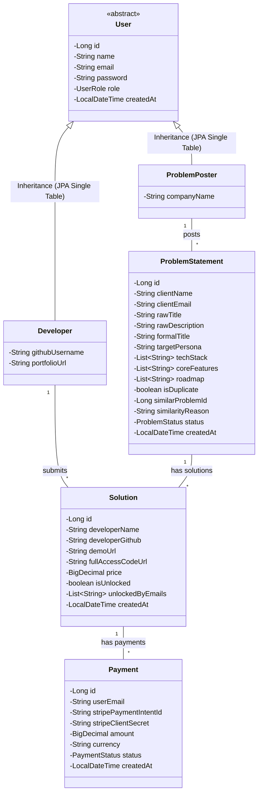
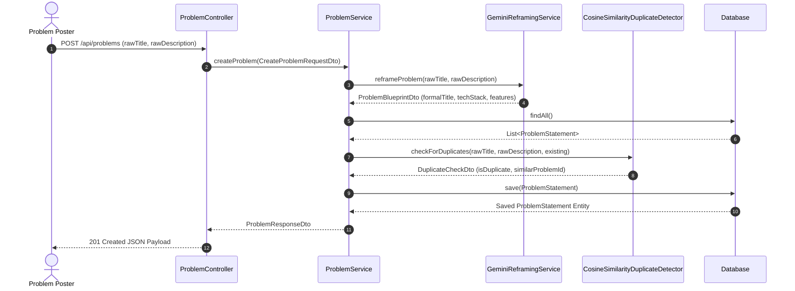
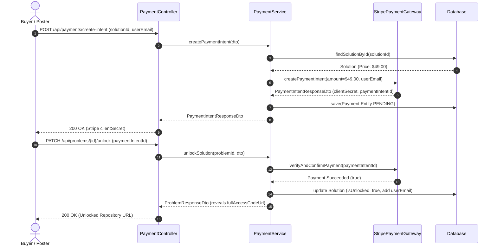

# BuildTheFix — Architecture & System Design Specification

This document provides a comprehensive technical breakdown of the object-oriented design, JPA entity models, layered service architecture, external integration contracts, and request flows in the Java Spring Boot edition of **BuildTheFix**.

---

## 1. Object-Oriented Domain Model & Inheritance



### Class Design Rationale

1. **`User` (Abstract Base Class)**
   - Implements JPA Single Table Inheritance (`@Inheritance(strategy = InheritanceType.SINGLE_TABLE)`).
   - Promotes code reuse by centralizing common authentication attributes (`id`, `name`, `email`, `password`, `role`, `createdAt`).
   - Private field encapsulation with public getters/setters.

2. **`ProblemPoster` (Subclass)**
   - Discriminates as `"PROBLEM_POSTER"`.
   - Represents non-technical domain experts describing real-world bottlenecks.

3. **`Developer` (Subclass)**
   - Discriminates as `"DEVELOPER"`.
   - Adds developer-specific attributes (`githubUsername`, `portfolioUrl`).

4. **`ProblemStatement` (Entity)**
   - Encapsulates raw user input alongside AI-reframed blueprint fields (`formalTitle`, `targetPersona`, `techStack`, `coreFeatures`, `roadmap`).
   - Contains duplicate detection status fields (`isDuplicate`, `similarProblemId`, `similarityReason`).

5. **`Solution` (Entity)**
   - Connects developers to problem statements.
   - Encapsulates public `demoUrl` (accessible to all) and locked `fullAccessCodeUrl` (hidden until Stripe payment confirmation).

6. **`Payment` (Entity)**
   - Tracks Stripe PaymentIntent transactions (`stripePaymentIntentId`, `amount`, `status`).

---

## 2. Layered Architecture & Component Diagram

```mermaid
graph TD
    Client[Web Client / REST Consumer] --> Controllers
    
    subgraph Controller Layer
        AuthController[AuthController]
        ProblemController[ProblemController]
        SolutionController[SolutionController]
        PaymentController[PaymentController]
    end

    subgraph Service Layer
        UserService[UserService]
        ProblemService[ProblemService]
        SolutionService[SolutionService]
        PaymentService[PaymentService]
    end

    subgraph Interfaces & Integrations
        AiReframingService[AiReframingService Interface] --> GeminiReframingService[GeminiReframingService]
        DuplicateDetector[DuplicateDetector Interface] --> CosineSimilarityDuplicateDetector[CosineSimilarityDuplicateDetector]
        PaymentGateway[PaymentGateway Interface] --> StripePaymentGateway[StripePaymentGateway]
    end

    subgraph Repository Layer
        UserRepository[(UserRepository)]
        ProblemRepository[(ProblemStatementRepository)]
        SolutionRepository[(SolutionRepository)]
        PaymentRepository[(PaymentRepository)]
    end

    Controllers --> Service Layer
    Service Layer --> Interfaces & Integrations
    Service Layer --> Repository Layer
```

---

## 3. Interfaces & Dependency Inversion Principle (SOLID)

- **`AiReframingService` & `GeminiReframingService`**
  - Interface defining `reframeProblem(String rawTitle, String rawDescription)`.
  - `GeminiReframingService` uses native `java.net.http.HttpClient` to communicate with Google Gemini API (`gemini-1.5-flash`). Fallback to internal synthesizer ensures uptime.

- **`DuplicateDetector` & `CosineSimilarityDuplicateDetector`**
  - Interface defining `checkForDuplicates(String title, String description, List<ProblemStatement> existing)`.
  - `CosineSimilarityDuplicateDetector` implements Token Jaccard index vector calculations and domain keyword matching.

- **`PaymentGateway` & `StripePaymentGateway`**
  - Interface defining `createPaymentIntent()` and `verifyAndConfirmPayment()`.
  - `StripePaymentGateway` interacts with official Stripe Java SDK (`stripe-java`).

---

## 4. End-to-End Request Flows

### A. Problem Submission & AI Blueprint Reframing


### B. Stripe Payment & Solution Unlocking


---

## 5. Comprehensive Class Directory

| Class | Package | Purpose |
| :--- | :--- | :--- |
| [`User`](file:///c:/Users/dolly/.gemini/antigravity-ide/scratch/BuildTheFix/src/main/java/com/buildthefix/app/entity/User.java) | `com.buildthefix.app.entity` | Abstract base JPA entity using Single Table Inheritance |
| [`ProblemPoster`](file:///c:/Users/dolly/.gemini/antigravity-ide/scratch/BuildTheFix/src/main/java/com/buildthefix/app/entity/ProblemPoster.java) | `com.buildthefix.app.entity` | Subclass for non-technical problem submitters |
| [`Developer`](file:///c:/Users/dolly/.gemini/antigravity-ide/scratch/BuildTheFix/src/main/java/com/buildthefix/app/entity/Developer.java) | `com.buildthefix.app.entity` | Subclass for software builders |
| [`ProblemStatement`](file:///c:/Users/dolly/.gemini/antigravity-ide/scratch/BuildTheFix/src/main/java/com/buildthefix/app/entity/ProblemStatement.java) | `com.buildthefix.app.entity` | Entity encapsulating raw text, reframed blueprint, and status |
| [`Solution`](file:///c:/Users/dolly/.gemini/antigravity-ide/scratch/BuildTheFix/src/main/java/com/buildthefix/app/entity/Solution.java) | `com.buildthefix.app.entity` | Entity encapsulating demo links and locked source repositories |
| [`Payment`](file:///c:/Users/dolly/.gemini/antigravity-ide/scratch/BuildTheFix/src/main/java/com/buildthefix/app/entity/Payment.java) | `com.buildthefix.app.entity` | Entity tracking Stripe transactions |
| [`AiReframingService`](file:///c:/Users/dolly/.gemini/antigravity-ide/scratch/BuildTheFix/src/main/java/com/buildthefix/app/service/AiReframingService.java) | `com.buildthefix.app.service` | Interface contract for AI problem reframing |
| [`GeminiReframingService`](file:///c:/Users/dolly/.gemini/antigravity-ide/scratch/BuildTheFix/src/main/java/com/buildthefix/app/service/impl/GeminiReframingService.java) | `com.buildthefix.app.service.impl` | Google Gemini API integration via Java 17 HttpClient |
| [`DuplicateDetector`](file:///c:/Users/dolly/.gemini/antigravity-ide/scratch/BuildTheFix/src/main/java/com/buildthefix/app/service/DuplicateDetector.java) | `com.buildthefix.app.service` | Interface contract for duplicate problem checking |
| [`CosineSimilarityDuplicateDetector`](file:///c:/Users/dolly/.gemini/antigravity-ide/scratch/BuildTheFix/src/main/java/com/buildthefix/app/service/impl/CosineSimilarityDuplicateDetector.java) | `com.buildthefix.app.service.impl` | Token similarity & domain keyword duplicate detector |
| [`PaymentGateway`](file:///c:/Users/dolly/.gemini/antigravity-ide/scratch/BuildTheFix/src/main/java/com/buildthefix/app/service/PaymentGateway.java) | `com.buildthefix.app.service` | Interface contract for payment gateways |
| [`StripePaymentGateway`](file:///c:/Users/dolly/.gemini/antigravity-ide/scratch/BuildTheFix/src/main/java/com/buildthefix/app/service/impl/StripePaymentGateway.java) | `com.buildthefix.app.service.impl` | Stripe Java SDK payment gateway implementation |
| [`UserService`](file:///c:/Users/dolly/.gemini/antigravity-ide/scratch/BuildTheFix/src/main/java/com/buildthefix/app/service/UserService.java) | `com.buildthefix.app.service` | Business logic for user registration & login |
| [`ProblemService`](file:///c:/Users/dolly/.gemini/antigravity-ide/scratch/BuildTheFix/src/main/java/com/buildthefix/app/service/ProblemService.java) | `com.buildthefix.app.service` | Business logic for problem posting, searching, & stats |
| [`SolutionService`](file:///c:/Users/dolly/.gemini/antigravity-ide/scratch/BuildTheFix/src/main/java/com/buildthefix/app/service/SolutionService.java) | `com.buildthefix.app.service` | Business logic for claiming problems & demo submissions |
| [`PaymentService`](file:///c:/Users/dolly/.gemini/antigravity-ide/scratch/BuildTheFix/src/main/java/com/buildthefix/app/service/PaymentService.java) | `com.buildthefix.app.service` | Business logic for Stripe PaymentIntents & solution unlocking |
| [`GlobalExceptionHandler`](file:///c:/Users/dolly/.gemini/antigravity-ide/scratch/BuildTheFix/src/main/java/com/buildthefix/app/exception/GlobalExceptionHandler.java) | `com.buildthefix.app.exception` | Unified `@RestControllerAdvice` error handler |
